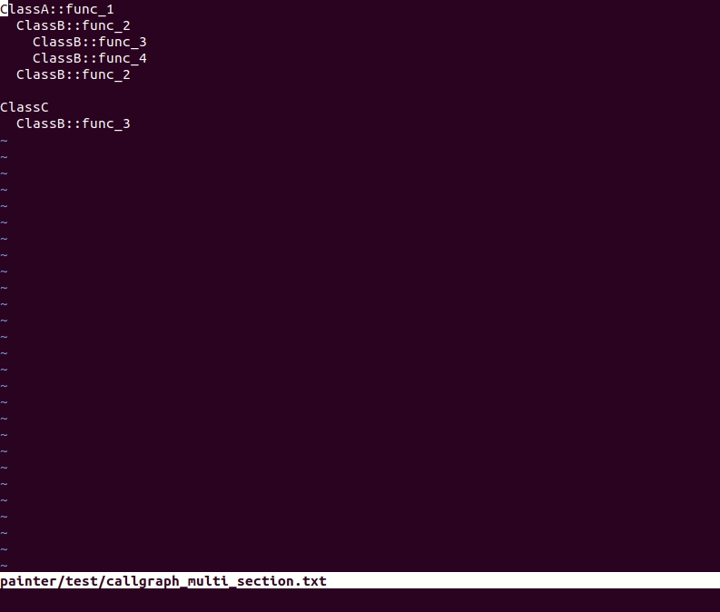

ASCII Painter
=============

It's work-in-progress. Inspired by asciiflow.com, this tool converts callgraph
text into ascii text-based graph.

Check out [todo](todo.md) for implementation progress and plan.

## Example

```
ClassA::func_1
  ClassB::func_2
    ClassB::func_3
    ClassB::func_4
  ClassB::func_2

ClassC
  ClassB::func_3
```

to UML sequence:

```
    ┌──────┐    ┌──────┐    ┌──────┐
    │ClassA│    │ClassB│    │ClassC│
    └──────┘    └──────┘    └──────┘
 func  │           │           │
 _1    │           │           │
──────►│           │           │
       │           │           │
       │ func_2    │           │
       │──────────►│           │
       │           │           │
       │           │────┐      │
       │           │    │      │
       │           │ func_3    │
       │           │    │      │
       │           │◄───┘      │
       │           │           │
       │           │────┐      │
       │           │    │      │
       │           │ func_4    │
       │           │    │      │
       │           │◄───┘      │
       │           │           │
       │ func_2    │           │
       │──────────►│           │
       │           │           │
       │           │  func_3   │
       │           │◄──────────│
       │           │           │
```

## Syntax

_CallGraph_: _Statements_?

_Statements_: _ComponentIdentifier_::_function\_identifier_

    with spaces in front of each statement indicating the calling stack depth;

    with empty line separating callgraph sections to switch calling component, which
    is automatically derived within each section.


_ComponentIdentifier_: string type without space, perferred in CamelCase

_function\_identifier_: string type without space, preferred in snake_case

## Usage

```bash
cat ./painter/test/callgraph.txt | cargo run
cargo build --release
cat ./painter/test/callgraph.txt | ./target/release/ascii_painter

# install (from repo dir)
cargo install --path ./ascii_painter
```

## Demo

After installing ascii\_painter, callgraph text in vim can be turned to graph as demonstrated below:


